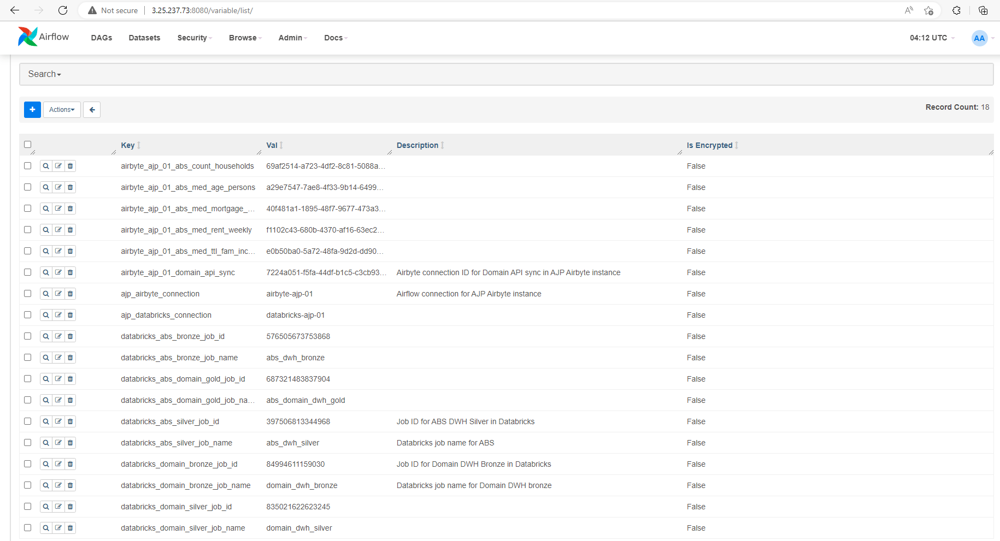

# Real Estate + Census Data ELT Pipeline - Data Engineer Camp 2022-09

## Overview
A data engineering ELT pipeline combining data from two APIs:
- [Domain Real Estate API - Individual Sales Results per City](https://developer.domain.com.au/docs/latest/apis/pkg_properties_locations/references/salesresults_listings)
- [ABS Census Data APIs](https://www.abs.gov.au/about/data-services/application-programming-interfaces-apis/data-api-user-guide) retrieving the following data:
    - Median age per person
    - Median monthly mortgage repayment
    - Median weekly rent
    - Median weekly total family income

The project is divided into the following components:
- [Airbyte for ingestion](https://github.com/Keatnuxsuo/laughing-couscous/tree/main/airbyte)
- [Databricks for processing](https://github.com/Keatnuxsuo/laughing-couscous/tree/main/notebooks)
- [Airflow for orchestration](https://github.com/Keatnuxsuo/laughing-couscous/tree/main/airflow)

## Get Started

1. Sign up for an account at the [Domain Developer Website](http://developer.domain.com.au)
2. Create an API key
3. Get access to a Databricks tenant to run the notebooks - [Databricks Community Edition](https://docs.databricks.com/getting-started/community-edition.html) will let you run but not orchestrate the notebooks
4. Clone the repository, e.g. ```git clone https://github.com/Keatnuxsuo/laughing-couscous.git```
5. Follow the individual sections for setting up the different services.

## Reference Architecture
The following diagram shows a possible deployment across multiple clouds - individual cloud infrastructure pieces on AWS, with Databricks running in Azure:


This architecture uses:
- Amazon Elastic Compute virtual machines to run Airbyte for ingestion
- Azure Databricks (premium workspace) to host both notebooks and configure compute jobs for them
- Amazon Elastic Compute virtual machines to run Airflow for orchestration
- Docker images deployed locally on the virtual machines to install both Airbyte and Airflow 
- S3 buckets to store both the raw JSON data from the APIs and the processed Delta Lake tables from Databricks
- Azure Active Directory to control access to Databricks
- AWS IAM and relevant access keys to control access to S3
- Databricks secret scopes to hide the AWS IAM keys.

## Setup
This setup is based on the above reference architecture.

### S3
1. Create an S3 bucket for this project with a name of your choice (we chose `domain-dwh`)
2. Create a new IAM user with a name of your choice (we chose `domain-dwh-bucket`)
3. Create an IAM policy for this user with a name of your choice (we chose `domain-dwh-bucket-dbx`)
4. Assign the policy to the user from step 2.
5. Generate access keys/secrets for the user from step 2.

The policy from step 3 must allow the user to list all buckets and get bucket locations. It must also be able to perform all actions on the bucket from step 1 and its sub-folders.

Example:
```
{
    "Version": "2012-10-17",
    "Statement": [
        {
            "Effect": "Allow",
            "Action": [
                "s3:GetBucketLocation",
                "s3:ListAllMyBuckets"
            ],
            "Resource": "arn:aws:s3:::*"
        },
        {
            "Effect": "Allow",
            "Action": "s3:*",
            "Resource": [
                "arn:aws:s3:::domain-dwh/*",
                "arn:aws:s3:::domain-dwh"
            ]
        }
    ]
}
```

### Airbyte
1. Install Docker on the machine you wish to use it on (locally or virtual machine)
2. Clone this repository on the same machine as step 1
3. Navigate to and build docker images for each connector:
    - airbyte-integrations/connectors/source-abs-data: ``` docker build . -t airbyte/source-abs-data:latest ```
    - airbyte-integrations/connectors/source-domain-api: ``` docker build . -t airbyte/source-domain-api:latest ```
4. Clone the Airbyte repository on the same machine as step 1: ``` git clone https://github.com/airbytehq/airbyte.git  ```
5. Run Airbyte - typically ``` cd airbyte && docker-compose up ``` after cloning the Airbyte repository
6. Open Airbyte (generally running on port 8000)
7. Navigate through the following menus:
    - Settings
    - Sources
    - New Connector
8. Enter the following for ABS:
    - Display name: whatever you prefer (we chose ABS API)
    - Docker repository name: ``` airbyte/source-abs-data ```
    - Docker image tag: ``` latest ```
    - Connector documentation URL: ``` https://www.abs.gov.au/about/data-services/application-programming-interfaces-apis/data-api-user-guide ```
9. Enter the following for Domain:
    - Display name: whatever you prefer (we chose Domain API)
    - Docker repository name: ``` airbyte/source-domain-api ```
    - Docker image tag: ``` latest ```
    - Connector documentation URL: ``` https://developer.domain.com.au/docs/latest/apis/pkg_properties_locations/references/salesresults_listings ```
10. Create the following sources in Airbyte as per the tables below

ABS:
| Name | Type      | Endpoint | start_date | metric_name | dimension_detail |
|:---  |:---       |:---      |:---        |:---         |:---              |
| ABS API - med_age_persons | ABS API | https://api.data.abs.gov.au/data/ABS,C21_G02_POA,1.0.0/1... | 2021 | med_age_persons | AllDimensions
| ABS API - med_mortgage_repymt_mthly | ABS API | https://api.data.abs.gov.au/data/ABS,C21_G02_POA,1.0.0/5... | 2021 | med_mortgage_repymt_mthly | AllDimensions
| ABS API - med_rent_weekly | ABS API | https://api.data.abs.gov.au/data/ABS,C21_G02_POA,1.0.0/6... | 2021 | med_rent_weekly | AllDimensions
| ABS API - med_ttl_fam_income_weekly | ABS API | https://api.data.abs.gov.au/data/ABS,C21_G02_POA,1.0.0/3... | 2021 | med_ttl_fam_income_weekly | AllDimensions
**NOTE: THE ENDPOINTS MUST CONTAIN THE TRAILING DOTS**

Domain:
| Name | Type      | Cities | api_key |
|:---  |:---       |:---    |:---     |
| Domain API | Domain API | Sydney, Melbourne, Adelaide | Your API key |

11. Create the following destinations in Airbyte as per the table below

| Name | Type      | S3 Key ID | S3 Access Key | S3 Bucket Name | S3 Bucket Path | S3 Bucket Region | Output Format |
|:---  |:---       |:---       |:---           |:---            |:---            |:---              |:---           |
| S3 - ABS - med_age_persons | S3 | Your S3 ID | Your S3 key | Your S3 bucket name | bronze/abs/med_age_persons | Your S3 bucket region | JSONL
| S3 - ABS - med_mortgage_repymt_mthly | S3 | Your S3 ID | Your S3 key | Your S3 bucket name | bronze/abs/med_mortgage_repymt_mthly | Your S3 bucket region | JSONL
| S3 - ABS - med_rent_weekly | S3 | Your S3 ID | Your S3 key | Your S3 bucket name | bronze/abs/med_rent_weekly | Your S3 bucket region | JSONL
| S3 - ABS - med_ttl_fam_income_weekly | S3 | Your S3 ID | Your S3 key | Your S3 bucket name | bronze/abs/med_ttl_fam_income_weekly | Your S3 bucket region | JSONL
| S3 - Domain | S3 | Your S3 ID | Your S3 key | Your S3 bucket name | bronze/domain | Your S3 bucket region | JSONL |

12. Set up connections from each ABS API and Domain endpoint as per the table below. All of them should be configured as manual syncs.

| Source | Destination | Frequency   | Namespace | Custom format | Sync mode |
|:---    |:---         |:---         |:---       |:---           |:---       |
| ABS API - med_age_persons | S3 - ABS - med_age_persons | Manual sync | Mirror source structure | N/A | full refresh/overwrite
| ABS API - med_mortgage_repymt_mthly | S3 - ABS - med_mortgage_repymt_mthly | Manual sync | Mirror source structure | N/A | full refresh/overwrite
| ABS API - med_rent_weekly | S3 - ABS - med_rent_weekly | Manual sync | Mirror source structure | N/A | full refresh/overwrite
| ABS API - med_ttl_fam_income_weekly | S3 - ABS - med_ttl_fam_income_weekly | Manual sync | Mirror source structure | N/A | full refresh/overwrite
| Domain API | S3 - Domain | Manual sync | Custom format | sales_listings | full refresh/append

13. Copy each connection's ID from its page URL for later use in Airflow.

### Databricks
1. Navigate to your Databricks tenant
2. Create a personal access token as per [Databricks documentation](https://docs.databricks.com/dev-tools/auth.html#:~:text=To%20create%20a%20Databricks%20personal%20access%20token%20for,Copy%20the%20displayed%20token%2C%20and%20then%20click%20Done.)
3. Set up the GitHub repo integration as per [Databricks documentation](https://docs.databricks.com/repos/repos-setup.html)
4. Navigate to Workflows in your Databricks tenant
5. Create a new cluster
6. Create a new job for each notebook. Note the job names - they will be necessary for Airflow.

### Airflow
1. Install Docker on the machine you wish to use it on (locally or virtual machine)
2. Clone this repository on the same machine as step 1
3. Navigate to the airflow directory
4. Run docker-compose up. This will build a custom, extended Docker image that includes Airbyte and Databricks providers
5. Configure the following connections:
    - Airbyte
        - Name: airbyte-ajp-01
        - Host: IP address of your VM
        - Port: 8001 (default)
    - Databricks
        - Name: airbyte-databricks-01
        - Host: URL of your Databricks tenant
        - Password: Your personal access token from Databricks step 2
6. Configure the following variables:
    - One per Databricks job/notebook
    - One per Airbyte integration

The table below shows the variables to set up.
| Key | Val |
|:--- |:--- |
airbyte_ajp_01_abs_med_age_persons | Your med_age_persons airbyte connector ID
airbyte_ajp_01_abs_med_mortgage_repymt_mthly | Your abs_med_mortgage_repymt_mthly airbyte connector ID
airbyte_ajp_01_abs_med_rent_weekly | Your med_rent_weekly airbyte connector ID
airbyte_ajp_01_abs_med_ttl_fam_income_weekly | Your med_ttl_fam_income_weekly airbyte connector ID
airbyte_ajp_01_domain_api_sync | Your Domain airbyte connector ID
ajp_airbyte_connection | airbyte-ajp-01
ajp_databricks_connection | airbyte-databricks-01
databricks_abs_bronze_job_name | Job set up for ABS_AWS_S3_Delta_Bronze.py
databricks_abs_domain_gold_job_name | Job set up for Combined_Delta_to_Delta_Gold.py
databricks_abs_silver_job_name | Job set up for ABS_Delta_Bronze_to_Delta_Silver.py
databricks_domain_bronze_job_name |	Job set up for Domain_AWS_S3_to_Delta_Bronze.py
databricks_domain_silver_job_name | Job set up for Domain_Delta_Bronze_to_Delta_Silver.py

Here's a sample of how it might look, including job IDs if you wish to configure them (they are not necessary).


7. If necessary, copy airflow/dags/domain_dwh.py to the correct folder for your Airflow docker image.

## Acknowledgments

### Primary Contributors
- [Keatnuxsuo](https://github.com/Keatnuxsuo)
- [tanhtra](https://github.com/tanhtra)
- [infinit3labs](https://github.com/infinit3labs)
- [ajpotts01](https://github.com/ajpotts01)